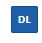
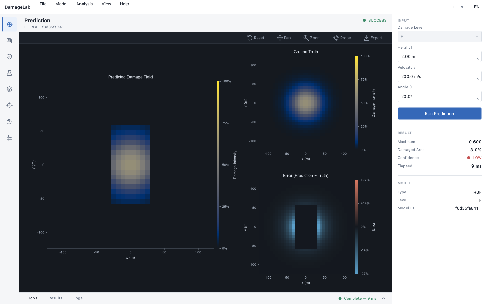
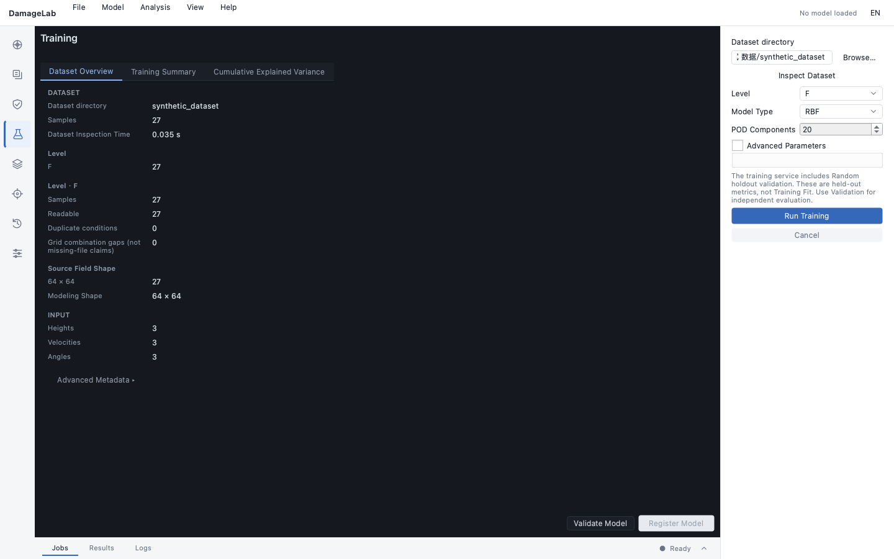
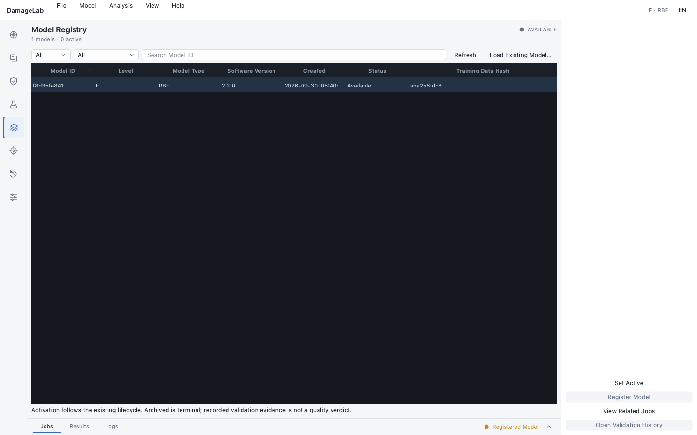

# DamageLab — Fast Damage-Field Prediction Workbench



[中文 README](README.md) · **English**

DamageLab is an engineering workbench for fast reconstruction and assessment of two-dimensional damage fields from simulated flight or impact conditions. Given `(h, v, deg)` and a damage level (`F`, `M`, or `P`), it predicts a continuous `473 × 473` field instead of a single scalar value.

The project provides a **Qt desktop application (macOS / Windows / Linux)**, a command-line interface, and an optional FastAPI service. The desktop and Web workbenches support live Chinese / English switching through their language selectors; language changes affect presentation only and never alter model files, CSV/SQLite formats, or scientific results.

**Research positioning:** Centroid-Aligned POD-RBF Surrogate Model for Fast Reconstruction and Assessment of High-Dimensional Damage Fields.

## Why centroid-aligned POD-RBF?

Damage patterns move spatially as the operating condition changes. Direct pixel-wise interpolation can therefore blur or duplicate the pattern. DamageLab separates shape from translation:

```text
DamageMatrix simulation data
  → bilateral denoising
  → centroid extraction and alignment
  → POD / PCA dimensionality reduction
  → RBF interpolation of shape coefficients and centroids
  → centroid restoration and 2-D field reconstruction
  → metrics, OOD confidence, visualization, and aim-point optimization
```

The implementation also supports structured validation (random, leave-h, leave-v, leave-deg, and corner holdout), raw/smoothed evaluation, spatial metrics (centroid, peak, IoU, Dice), and CEP / REP-DEP aim-point optimization.

## Product capabilities

- Cross-platform Qt (PySide6) desktop workbench: prediction, training, validation, batch, model registry, and history in a CAE-style shell with a dark scientific viewport and live language switching.
- Background task state machine for training, prediction, validation, and batch operations, including cooperative cancellation.
- Model registry with joblib bundles, sidecar metadata, data fingerprints, software/model/schema versions, and Git commit traceability.
- OOD confidence based on nearest-neighbor distance, global SVD support, and local training-neighborhood support.
- CSV batch prediction with row-level failure isolation, progress, cancellation, and SQLite traceability.
- FastAPI endpoints and a dependency-light browser workbench for health, models, prediction, batch jobs, history, results, and aim optimization.
- PyInstaller onedir release packaging (`DamageLab-<version>-<platform>`) for the Qt desktop and Docker Compose deployment for the Web service.

## Technology stack

| Layer | Technology | Role |
|---|---|---|
| Runtime | Python 3.10–3.14 | Scientific computing, desktop, CLI, and Web service |
| Desktop UI | PySide6 (Qt 6), QtAgg; Tkinter (legacy) | CAE-style cross-platform workbench: tool-rail navigation, dark scientific viewport, inspector, activity panel |
| Scientific computing | NumPy, SciPy, Pandas, scikit-learn, joblib | Arrays, filtering, interpolation, reduction, data, and persistence |
| Surrogate model | POD/PCA, centroid alignment, RBF | Reduced-order damage-field reconstruction |
| Evaluation | RMSE, MAE, R², relative error, IoU, Dice, OOD geometry | Numerical, spatial, and extrapolation-risk assessment |
| Visualization | Matplotlib (QtAgg backend), high-DPI PNG rendering | Damage, prediction, error, and aim-point views |
| Service | FastAPI, Pydantic, Uvicorn, httpx2 | Health, model, prediction, batch, history, and result APIs |
| Web UI | Native HTML, CSS, and JavaScript | No-build browser workbench |
| Traceability | SQLite, CSV, JSON sidecars, rotating logs | Model, job, result, input, and version history |
| Delivery | PyInstaller onedir (Qt / legacy Tk), Docker, Docker Compose, Nginx | macOS/Windows/Linux desktop release and reverse-proxied server deployment |
| Quality | unittest, ruff, GitHub Actions, numerical golden values | Linting, cross-platform tests, builds, and regression control |

## Screenshots and branding

These are screenshots captured from the current running Qt desktop application, not mockups:







More workbench screenshots (validation / history / Chinese UI / 1280×720) are kept in [`examples/screenshots/qt/`](examples/screenshots/qt/). Desktop usage instructions are in [`docs/desktop.md`](docs/desktop.md); legacy Tkinter screenshots remain in `examples/screenshots/` for reference.

The `DL` product mark is shared by the desktop and Web interfaces. Source assets are kept in `src/damage_gui/gui/assets/` and `src/damage_gui/webapp/static/assets/`; the Qt packaging spec (`scripts/damagelab-qt.spec`) bundles the desktop icon and the SVG icon set into the release package.

## Quick start

### Desktop application (Qt, recommended)

macOS / Windows / Linux, Python 3.10+:

```bash
python -m venv .venv
source .venv/bin/activate           # Windows: .venv\Scripts\Activate.ps1
pip install -e ".[desktop-qt]"
damage-gui-qt
```

Basic workflow after launch:

1. **Load a model**: on the prediction page, Open Model (`Cmd/Ctrl+O`) to pick a `*.joblib` bundle, or train a new one from a local data directory on the training page.
2. **Model registry**: register the trained model, review its lifecycle status, and activate it.
3. **Predict**: enter `(h, v, deg)` in the inspector → Run Prediction (`F5`); the dark viewport shows the predicted / truth / error fields with pan, zoom, probe, and PNG export.
4. **Validate**: choose a structured validation mode (random / leave-layer-out / corner holdout).
5. **Batch**: import a conditions CSV and export the batch report.
6. **History**: trace every job (training / prediction / batch / validation) with input reconstruction.

Desktop data (SQLite trace DB, logs, reports) is written to the platform user-data directory (macOS `~/Library/Application Support/DamageLab`, Windows `%APPDATA%\DamageLab`, Linux `~/.local/share/DamageLab`), never the install directory. Common shortcuts: `Cmd/Ctrl+O` open model, `Cmd/Ctrl+R` run current page, `Cmd/Ctrl+F` search, `Cmd/Ctrl+E` export, `Cmd/Ctrl+L` logs, `F5` predict. See [`docs/desktop.md`](docs/desktop.md) for the full guide.

### Legacy desktop (Tkinter)

```bash
pip install -r requirements.txt
PYTHONPATH=src python -m damage_gui.desktop
```

The legacy workbench still runs (pip entry point `damage-gui`) but new features land only in the Qt build; all desktop users should migrate to `damage-gui-qt`.

### CLI

```powershell
# Inspect model metadata
python -m damage_gui.cli info --model damage_model_F.joblib

# Predict one condition and optionally export the field
python -m damage_gui.cli predict --model damage_model_F.joblib `
    --h 1 --v 300 --deg 30 --export pred.csv

# Predict a CSV batch with optional truth comparison
python -m damage_gui.cli batch --model damage_model_F.joblib `
    --input batch.csv --output batch_result.csv --data-dir data
```

Batch failures are isolated per row. Exit codes are `0` for all successful rows, `1` for failed or cancelled work, and `2` for invalid input.

## Web service and Docker

Install the optional service dependencies and run the API:

```powershell
pip install -e ".[web]"
damage-gui-web
```

Alternatively:

```powershell
uvicorn damage_gui.webapp.app:app --host 127.0.0.1 --port 8000
```

Open `http://127.0.0.1:8000/` for the browser workbench and `/docs` for the OpenAPI documentation. For a containerized deployment:

```powershell
docker compose up --build
```

The server loads models lazily, keeps large matrices out of JSON responses, writes generated artifacts to the configured result directory, and exposes health checks for deployment orchestration. See [`docs/web-api.md`](docs/web-api.md) and [`docs/deployment.md`](docs/deployment.md) for the operational details.

## Reproducible validation

The repository includes 236 synthetic-data unit tests (algorithm, metrics, end-to-end pipelines, storage, task state machine, batch, CLI, and Web API, plus the M3 scientific-validation framework: ablation, baselines, benchmark, uncertainty, tracking, lifecycle, drift, RBF numerical guards, and Hypothesis property tests) as well as numerical regression tests with fixed golden values. Private simulation matrices are intentionally not committed. With local data available, structured validation and study reports can be regenerated with:

```powershell
$env:PYTHONPATH = "src"
python scripts/validation_study.py --data-dir path\to\data --level F
python scripts/generate_results.py --data-dir path\to\data --level F
```

Run the test suite and lint checks:

```powershell
python -m unittest discover -s tests -v
ruff check .
```

## M3 validation results

The M3 phase closed the scientific-validation loop on the local real simulation matrix
(`dist/data`, 120 cases per level F/M/P; a full 5-altitude x 4-velocity x 6-angle factorial
grid): ablation attribution, external baselines, performance benchmarking, per-sample
uncertainty, experiment tracking, model lifecycle, property-based tests, and drift detection.
87 experiments (63 core matrix + 24 multiquadric-epsilon supplement) were persisted and recorded in
`examples/results/experiments/experiments.sqlite3` (seed 42, commit `b6803e2`, per-level
training-data fingerprints).

**Production model: `pod_rbf` (centroid alignment on, K=20 POD modes, thin-plate-spline
kernel), out-of-fold metrics under random 80/20 holdout:**

| Model | R²(sm) | Dice | Centroid Error | Inference (warm, per image) |
|---|---:|---:|---:|---:|
| pod_rbf · F | 0.9539 | 0.8798 | 0.1838 m | 10.16 ms |
| pod_rbf · M | 0.9462 | 0.8805 | 0.1857 m | 11.97 ms |
| pod_rbf · P | 0.4460 | 0.8285 | 0.2177 m | 9.29 ms |

> Inference is the mean latency for a single 473x473 damage field at batch=100 steady state
> (single-machine measurement); the model artifact is only **2.5 MB**, shippable with the
> desktop GUI / web app.

**Stated limitations (not glossed over):**

- **P-level R²(sm) is only 0.4460**, and external baselines are equally low (linear 0.3538,
  nn 0.1159) — this is intrinsic data dispersion at the P level, not an engineering defect;
  Dice 0.8285 and mean relative error 0.1235 remain usable and must be read together.
- **Leave-v-out extrapolation at the P level gives R²(sm) = -0.6124 (negative)**, i.e. worse
  than the mean under that protocol — a hard limitation not to be masked by its low P95.
- **Simple external baselines are competitive on some metrics**: at F/M, `linear` matches the
  production R²(sm) and `nn` scores higher Dice/IoU. `pod_rbf` is chosen for the combination
  of best centroid accuracy + 2.5 MB artifact + continuous parameterization + OOD/uncertainty
  guards, not for leading any single metric.
- **pod_rbf training carries ~1e-4-magnitude nondeterminism (known reproducibility risk,
  deferred to the next release)**: at production data sizes, sklearn PCA selects randomized
  SVD with an unfixed `random_state`, so two same-config trainings can differ in the fourth
  decimal place (e.g. the P-level K=20 pair 0.4460/0.4459 in the ablation study). No
  conclusion in this section is affected; see
  [M3 acceptance report §7.9](docs/m3-acceptance-report.md).

Full evidence chain: [model validation report](docs/model-validation-report.md) |
[ablation study](docs/ablation-study.md) | [uncertainty validation](docs/uncertainty-validation.md) |
[benchmark report](docs/benchmark-report.md) | [M3 acceptance report](docs/m3-acceptance-report.md).

## Desktop build

The Qt desktop release is a PyInstaller onedir package named `DamageLab-<version>-<platform>`:

```bash
# macOS / Linux
pip install "pyinstaller>=6,<7"
scripts/build_qt_release.sh            # PYTHON=.venv/bin/python overrides the interpreter

# Windows
scripts\build_qt_release.bat
```

Artifacts land in `release/DamageLab-<version>-<platform>/` (macOS: `DamageLab.app` + README; Windows/Linux: onedir + README). The package bundles the Qt entry point, the SVG icon set, the app icon, and Matplotlib resources; it does not include training data or `.joblib` models. Build details, known platform issues, and the acceptance checklist are in [`docs/desktop.md`](docs/desktop.md) and [`docs/release-checklist.md`](docs/release-checklist.md).

Legacy Tkinter build scripts (kept for compatibility):

```powershell
.\scripts\build.bat               # regular build
.\scripts\build_release.bat       # lightweight Windows release build
```

## Current limitations

- Aim-point optimization defines the dispersion ellipse in the target normal plane (A1/A2 assumption); the ground-plane → normal-plane projection for oblique impact has not been modeled yet.
- OOD detection is a three-layer geometric check (nearest-neighbor distance + SVD global hull + local neighborhood hull) with F/M/P thresholds calibrated on real structured validation; the local hull remains heuristic and should be recalibrated when the data grid changes.
- Qt desktop packages are **unsigned local builds** (no code-signing certificate): on macOS the first launch needs right-click → Open; Windows SmartScreen may show "More info → Run anyway". Platform acceptance status: macOS verified on real hardware; Windows build verified in CI (no manual on-hardware GUI acceptance this phase); Linux **NOT TESTED** (on Wayland prefer `QT_QPA_PLATFORM=xcb`).
- The Tkinter workbench (`damage-gui`) is retained but no longer evolves; new features are implemented only in the Qt build (`src/damage_gui/qt/`).

## License

MIT License. See [`LICENSE`](LICENSE).
