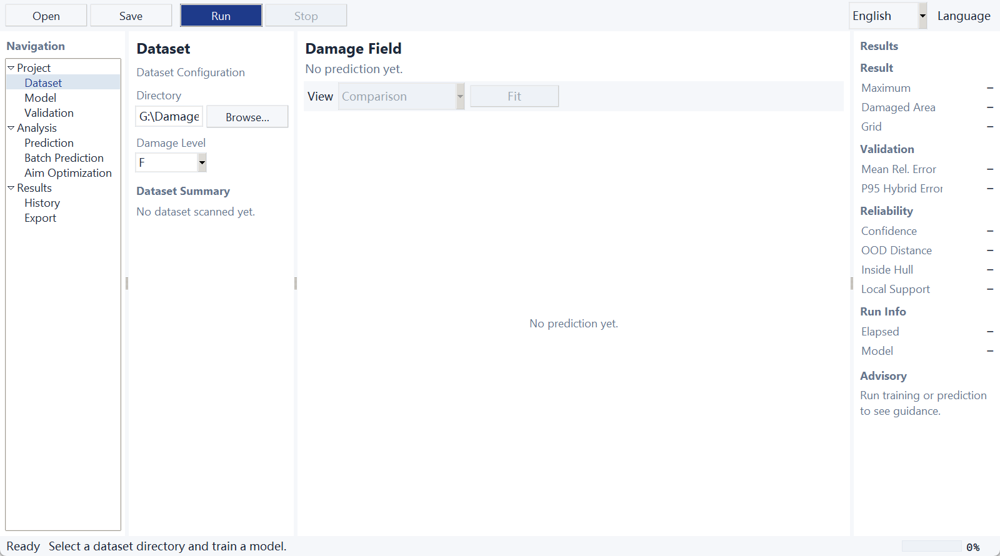

# 基于数据驱动的毁伤场快速预测系统


**中文** · [English](README.en.md)

这是一个面向仿真毁伤数据的工程化预测工作台：根据飞行/撞击工况重建二维毁伤场，并提供精度评估、可信度检测、可视化和瞄准点优化能力。产品同时提供 Windows 桌面 GUI、命令行工具和 FastAPI Web 服务，适合研究验证、批量计算与可追溯交付。

桌面端支持在运行时切换 **中文 / English**；语言只影响展示层，不改变模型文件、CSV/SQLite 数据格式或科学计算结果。项目同时具备模型元数据追溯、SQLite 任务/结果管理、后台任务状态机、批量预测、统一日志与错误体系、数值回归测试、双平台 CI 与 Windows 桌面交付。

**英文定位**：Centroid-Aligned POD-RBF Surrogate Model for Fast Reconstruction and Assessment of High-Dimensional Damage Fields

## 问题与目标

输入为工况参数 `(h, v, deg)` 与毁伤等级（`F`、`M`、`P`），输出为连续的 `473 × 473` 二维毁伤场，而非单一数值。

由于毁伤图案会随工况发生空间位移，直接逐像素插值容易产生图案淡化或重影。本项目将图案形状与空间平移分离后分别建模，以提升场重建质量。

## 方法流程

```text
仿真 DamageMatrix 数据
        → 双边滤波降噪（保留毁伤峰值与边缘）
        → 质心提取与对齐（形状与平移解耦，消除插值重影）
        → POD / PCA 降阶（K 个空间模态，可选）
        → RBF 在 (h, v, deg) 空间插值形状/模态系数与质心
        → 质心恢复 → 二维毁伤场预测
        → 精度评估（数值 + 空间双维度）/ OOD 可信度检测 / 瞄准优化
```

### 核心算法设计

- **双边滤波降噪**：只平滑数值相近的邻域，毁伤核心峰值（~1.0）完整保留（高斯平滑会把峰值压到 0.38，已弃用）。
- **质心对齐插值**：先把各工况图案平移到质心居中的标准位置再插值形状，质心轨迹单独插值——图案的移动被显式建模，消除"重影"。该设计通过合成移动高斯场实验验证（见 `tests/test_alignment.py`）。
- **POD-RBF 降阶模型**（可选）：利用毁伤场的空间相关性做 POD 降维，RBF 只需预测 K=10~30 维模态系数而非上万维像素，项目从"RBF 插值 GUI"升级为 **Reduced Order Model / Surrogate Modeling 系统**。
- **结构化交叉验证**：随机留出之外，支持按高度/速度/角度整层留出与角落区域留出——检验模型在"真正未见过的工况区域"上的可靠性，而非只在随机插值条件下表现良好。
- **OOD / 预测可信度检测**：组合最近训练工况距离、SVD 内在维度全局凸包与局部邻域凸包。SVD 可处理任意方向的共面/共线数据并拒绝偏离训练子空间的查询；局部凸包补充全局凸包无法表达凹形支撑域的缺陷，可把密集 L 形分布内部的数据空洞从 High 降为 Medium。GUI 会明确显示“全局凸包外”或“局部训练支撑不足”。
- **Raw / Smoothed 双口径评估**：同时报告逐像素口径与局部平均场口径指标，说明平滑口径的统计含义，避免"通过平滑刷指标"的质疑。
- **二维空间场指标**：质心误差、峰值位置/强度误差、IoU、Dice——覆盖空间位置与毁伤区域形状的评价维度。
- **瞄准点优化**：基于 CEP 或 REP/DEP 概率散布模型的价值场卷积 + argmax 最优瞄准点。支持完整协方差散布——相关系数 ρ ∈ (−1, 1) 的相关高斯核，以及 REP 主轴相对 x 轴旋转任意角度 θ 的散布椭圆（协方差矩阵参数化）。`monte_carlo_expected_damage` 提供落点采样的 Monte Carlo 独立验证：与解析卷积走不同数学路径，二者在统计容差内一致即可互证实现正确性（`tests/test_aim_correlation.py`）。

## 软件架构（Software Architecture）

```text
Desktop GUI (Tkinter) ──┐  训练 / 预测 / 批量 / 瞄准优化
CLI (damage-gui-cli) ───┤  info / predict / batch
研究脚本 (scripts/) ─────┘
            ↓
Application Services          TaskManager（任务状态机 + 协作式取消）
                              DamageModelService（训练编排 + 评估）
                              model.registry（模型保存/加载校验）
                              batch.runner（批量预测执行器）
            ↓
Model / Evaluation / Optimization
                              rbf · pod · validation · ood
                              metrics · aim（纯算法，无 GUI/存储依赖）
            ↓
Storage / Files               SQLite 追溯库（models / jobs / prediction_results）
                              joblib 模型 + *.meta.json 元数据 sidecar
                              CSV 报告 · 轮转日志 logs/damage_gui.log
```

上层只经服务层调用算法层；算法核心（rbf/pod/ood/aim/metrics）不依赖 GUI 与存储，GUI、CLI 与脚本共享同一套业务实现。

## 工程化特性（Engineering Features）

- **模块化分层架构**：GUI / CLI / 服务层 / 算法层 / 存储层职责分离，入口瘦启动 + 向后兼容 re-export（旧模型文件可继续加载）。
- **后台任务状态机**：`PENDING → RUNNING → SUCCESS | FAILED | CANCELLED` 显式转移表（非法转移抛错）；GUI 不直接持有线程对象，训练与批量统一经 TaskManager 提交/取消/事件轮询，关窗安全终止。
- **SQLite 任务与结果追溯**：`models / jobs / prediction_results` 三表 + 索引，只存元数据与摘要（473×473 场阵不入库）；数据库故障**显式降级**——计算照常完成，但以 ERROR 日志 + 界面警告 + 返回值标志明确告知"未入库"，绝不静默。
- **模型元数据与版本管理**：每次训练产出 `model_id`、训练数据指纹（工况 + 文件内容 SHA-256）、git commit、训练参数与验证指标；三版本号分离（软件版本 / 元数据 schema / 模型格式），sidecar 与内嵌双写、加载时互相校验，旧版无元数据模型向后兼容。
- **可复现的结构化验证**：五种验证模式（随机留出 / 三种整层留出 / 角落外推）+ 固定随机种子。
- **批量预测**：CSV 输入/输出；行级失败隔离（单行出错不中断批次）；取消保留已完成行；每行输出含模型版本、OOD 可信度、真值对照指标与耗时；GUI 与 CLI 双入口。
- **统一日志与错误体系**：控制台 + 轮转文件日志；`DamageGuiError` 错误分层，GUI 只展示友好消息，完整 traceback 进日志文件。
- **自动化测试**：181 个 unittest 用例（算法、指标、端到端管线、存储、任务状态机、批量、CLI、Web API、DPI/无头导入），全合成数据、无私有数据依赖。
- **数值回归测试**：固定种子合成集上的黄金值对比（预测场 / POD 模态 / OOD 分级 / 核心指标）；容差依据双进程实测漂移（=0.0）设定，CI 双平台运行为最终权威；禁止为变绿随意放宽。
- **Windows/Linux 双平台 CI**：`ruff → 单元+数值回归测试 → Windows PyInstaller 真实构建（校验 exe 产物）→ artifact 上传`；仅 tag 推送才发布 Release。
- **Windows 桌面交付**：PyInstaller onedir 发布包（`scripts/build_release.bat`，CI 与本地同一路径）。

## 完整技术栈（Technology Stack）

| 层级 | 技术 | 用途 |
|---|---|---|
| 语言与运行时 | Python 3.10–3.12 | 科学计算、桌面端、CLI 与 Web 服务 |
| 桌面 UI | Tkinter / ttk、Windows ctypes DPI API | 原生 Windows 工作台、字体与多显示器 DPI 适配 |
| 科学计算 | NumPy、SciPy、Pandas、scikit-learn、joblib | 矩阵处理、滤波、插值、降阶、数据与模型持久化 |
| 降阶与代理模型 | POD/PCA、质心对齐 RBF | 高维毁伤场快速重建与空间位移解耦 |
| 评估与可信度 | Raw/Smoothed 指标、IoU/Dice、OOD 凸包/邻域检测 | 数值精度、空间形状和外推风险评估 |
| 可视化 | Matplotlib、TkAgg、PNG 高 DPI 渲染 | 热力图、误差场、瞄准优化结果 |
| 服务端 | FastAPI、Pydantic、Uvicorn、httpx2 | 健康检查、模型、预测、批量、历史和结果 API |
| Web 前端 | 原生 HTML / CSS / JavaScript | 无构建依赖的工程化浏览器工作台 |
| 数据与追溯 | SQLite、CSV、JSON sidecar、轮转日志 | 模型、任务、结果、输入和版本追溯 |
| 交付与部署 | PyInstaller onedir、Docker、Docker Compose、Nginx | Windows 桌面发布、非 root Web 容器、HTTPS 反代 |
| 质量保障 | unittest、ruff、GitHub Actions、数值黄金值回归 | 静态检查、双平台测试、构建和科学结果稳定性 |

## 产品界面与国际化

桌面端使用当前真实的四栏工程工作台：导航、上下文属性、Matplotlib 科学视口和结果追溯面板。工具栏右侧的 **语言 / Language** 选择器可即时切换中英文；模型类型、验证方式等内部值保持稳定。

中文界面：


English interface:



Web 端和桌面端共用 `DL` 品牌图标。图标资源位于 `src/damage_gui/gui/assets/` 与 `src/damage_gui/webapp/static/assets/`，PyInstaller 构建会将桌面图标一并打包。

## 模型追溯链（Model Traceability）

```text
训练数据（DamageMatrix 文件集）
    ↓ SHA-256（排序后的工况 + 源文件内容哈希）
训练数据指纹 training_data_hash
    ↓
模型 joblib + 元数据 sidecar（model_id · 三版本号 · 训练参数 · 验证指标 · git commit）
    ↓
结构化验证结果（Raw/Smoothed 双口径指标，随模型包保存）
    ↓
SQLite：models ← jobs(training) ← jobs(batch_prediction) ← prediction_results
    ↓
预测输出 CSV（每行携带 model_id + 软件版本 + OOD 分级 + 错误信息）
```

任何一条批量预测结果都能回溯到"哪个版本的数据 + 哪个 commit 的代码 + 哪个模型 + 何种验证结论"。

## 项目结构

```text
.
├── src/damage_gui/
│   ├── app.py                 # 应用入口（瘦启动器 + 向后兼容 re-export）
│   ├── cli.py                 # 工程化 CLI（info / predict / batch）
│   ├── config.py              # 全局配置（模型 / 预处理 / 评估 / UI / 工况范围）
│   ├── errors.py              # 统一错误体系
│   ├── logging_setup.py       # 控制台 + 轮转文件日志
│   ├── tasks.py               # 后台任务状态机与 TaskManager
│   ├── data/
│   │   ├── loader.py          # 工况解析与 DamageMatrix 读取
│   │   └── preprocessing.py   # 双边滤波、ROI、坐标网格、评估口径平滑
│   ├── model/
│   │   ├── rbf.py             # 质心对齐 RBF 插值场
│   │   ├── pod.py             # POD-RBF 降阶代理模型
│   │   ├── validation.py      # 结构化交叉验证切分
│   │   ├── ood.py             # OOD / 预测可信度检测
│   │   ├── bundle.py          # 训练编排、评估与模型包（ModelBundle）
│   │   ├── metadata.py        # 模型元数据（三版本号 + 数据指纹 + commit）
│   │   └── registry.py        # 模型保存/加载校验（joblib + meta.json sidecar）
│   ├── batch/
│   │   ├── schema.py          # 批量 CSV 输入校验与输出格式
│   │   └── runner.py          # 批量预测执行器（失败隔离 / 取消 / 追溯）
│   ├── storage/
│   │   ├── db.py              # SQLite 连接与幂等 schema
│   │   └── repositories.py    # models / jobs / prediction_results 仓储
│   ├── evaluation/
│   │   └── metrics.py         # 数值指标 + 空间场指标（质心/峰值/IoU/Dice）
│   ├── optimization/
│   │   └── aim.py             # 瞄准点优化（独立数学模块）
│   ├── visualization/
│   │   └── plots.py           # 热力图与误差场渲染
│   ├── gui/
│   │   ├── main_window.py     # Tkinter 主窗口（TaskManager 后台任务）
│   │   ├── i18n.py             # 中文/English 运行时翻译目录
│   │   ├── assets/             # DL PNG/ICO 品牌图标
│   │   ├── presentation.py    # 选项映射与指标展示文案
│   │   ├── resources.py       # 源码/打包双模式资源路径
│   │   └── widgets.py         # 通用小部件工具
│   └── webapp/
│       ├── app.py              # FastAPI 应用入口与 REST 路由装配
│       ├── routes/             # health / models / prediction / batch / history
│       └── static/             # 无构建依赖的浏览器工作台与品牌资源
├── scripts/
│   ├── build.bat              # 常规 PyInstaller 构建脚本
│   ├── build_release.bat      # 轻量版 Windows 发布构建脚本
│   ├── capture_gui_screenshots.py # 生成 README 使用的真实 GUI 截图
│   ├── batch_predict.py       # 批量预测入口（CLI 兼容封装）
│   ├── regen_regression_golden.py  # 数值回归黄金值再生成（受控）
│   ├── generate_results.py    # 从本地数据复现示例结果
│   ├── ablation_study.py      # 消融实验（降噪/对齐/POD 各自的贡献）
│   ├── validation_study.py    # 五种结构化验证汇总表
│   └── pod_sweep.py           # POD 模态数 K 扫描与性能对比
├── tests/                     # 181 个用例（单元 / 端到端 / 数值回归 + 黄金值）
├── docs/                      # 阶段验收报告与简历材料
├── .github/workflows/test.yml # CI（lint → 双平台测试 → Windows 构建 → artifact）
├── pyproject.toml             # 包元数据、依赖与 ruff 配置
├── LICENSE                    # MIT License
├── requirements.txt
└── README.md
```

仿真矩阵、训练模型、虚拟环境和打包产物均不纳入 Git。训练前请准备本地 `data/` 目录，文件名需符合：`DamageMatrix_<F|M|P>_h_<h>_v_<v>_deg_<deg>`。

## 快速开始

```powershell
python -m venv .venv
.\.venv\Scripts\Activate.ps1
pip install -r requirements.txt
$env:PYTHONPATH = "src"
python -m damage_gui.app
```

启动后，在 GUI 中选择本地数据目录、毁伤等级、模型类型（RBF / POD-RBF）与验证方式，训练或加载模型后即可输入工况进行预测。训练在后台线程执行，可随时取消；预测完成后显示耗时与模型可信度。

### 命令行（CLI）

核心功能可脱离 GUI 执行（安装后可用 `damage-gui-cli`，或 `python -m damage_gui.cli`）：

```powershell
# 查看模型元数据（模型 ID / 三版本号 / 训练数据指纹 / commit / 验证指标）
python -m damage_gui.cli info --model damage_model_F.joblib

# 单工况预测（含 OOD 可信度与耗时，可选导出预测矩阵 CSV）
python -m damage_gui.cli predict --model damage_model_F.joblib `
    --h 1 --v 300 --deg 30 --export pred.csv

# CSV 批量预测（输入列 job_id,h,v,deg,level；结果含模型版本/OOD/指标/耗时，
# 自动写入 SQLite 追溯库；--data-dir 提供真值对照指标）
python -m damage_gui.cli batch --model damage_model_F.joblib `
    --input batch.csv --output batch_result.csv --data-dir data
```

批量预测行级失败不中断批次（失败行以 FAILED + 错误信息记录）；退出码：0 全部成功、1 存在失败行或取消、2 输入错误。`scripts/batch_predict.py` 保留为兼容入口。

### Web 服务（FastAPI）

启动 API 与浏览器工作台：

```powershell
$env:PYTHONPATH = "src"
uvicorn damage_gui.webapp.app:app --host 127.0.0.1 --port 8000
```

打开 `http://127.0.0.1:8000/` 即可使用 Web 界面；`/docs` 提供 OpenAPI 文档。服务层与桌面端共享训练、预测、批量、历史和结果查询逻辑，默认只绑定本机地址，部署到服务器时请配合反向代理和访问控制。

仓库也提供 Docker Compose 配置，可用于本地或服务器部署：

```powershell
docker compose up --build
```

## 真实示例结果

下图和指标由本机 F 级仿真数据重新生成，采用默认固定随机种子进行 80/20 留出验证。代表性留出工况为 `h=1`、`v=300`、`deg=30`。

| 评价范围 | RMSE | MAE | R² | 平均相对误差 | P95 混合误差 |
|---|---:|---:|---:|---:|---:|
| 全场 | 0.0013 | 0.0001 | 0.9878 | — | — |
| ROI 区域 | 0.0071 | 0.0017 | 0.9864 | — | — |
| 主要毁伤区（`damage > 0.05`） | 0.0203 | 0.0125 | 0.9533 | 8.40% | 17.60% |


完整指标 CSV 与结果摘要见 [`examples/results`](examples/results)。如需复现：

```powershell
$env:PYTHONPATH = "src"
python scripts/generate_results.py --data-dir path\to\data --level F
```

## 结构化验证

随机 80/20 留出对规则工况网格偏乐观（测试点常被训练点包围）。GUI 与服务层支持以下验证方式：

| 验证方式 | 说明 |
|---|---|
| Random Holdout | 随机 80/20 留出（基线，插值口径） |
| Leave-h-out | 每个高度值轮流整层留出，聚合折外预测 |
| Leave-v-out | 每个速度值轮流整层留出 |
| Leave-deg-out | 每个角度值轮流整层留出 |
| Corner Holdout | 高速 + 大角度角落区域整块外推测试（默认 `v >= 250, deg >= 40`） |

整层留出的指标来自"真正未见过的工况区域"上的折外预测；交付模型最终在全部工况上重新训练。

使用本地真实仿真数据一次生成五种验证方式的 Markdown/CSV 汇总表：

```powershell
$env:PYTHONPATH = "src"
python scripts/validation_study.py --data-dir path\to\data --level F
```

默认输出到 `examples/results/validation_summary.md`，包含 Mean RE、P95 Hybrid、R²、IoU、Dice 与训练耗时。仓库不包含私有仿真矩阵，因此不会提交未经真实数据运行的占位数值。

本机 `dist/data` 的 F/M/P 三级真实数据均已完成验证。下表每格为
`Mean RE / P95 Hybrid`：

| 等级 | Random | Leave-h | Leave-v | Leave-deg | Corner |
|---|---:|---:|---:|---:|---:|
| F | 8.40% / 17.60% | 9.19% / 17.24% | 15.28% / 24.40% | 8.10% / 16.57% | 10.08% / 20.82% |
| M | 8.29% / 17.21% | 9.10% / 17.14% | 14.97% / 23.59% | 7.93% / 16.21% | 9.87% / 20.51% |
| P | 12.40% / 9.72% | 14.32% / 10.42% | 23.59% / 14.13% | 10.50% / 7.85% | 19.51% / 11.68% |

完整结果见 [`F`](examples/results/validation_summary.md)、
[`M`](examples/results/validation_summary_M.md)、
[`P`](examples/results/validation_summary_P.md)。三等级都表明速度方向整层外推最困难；
其中 P 级 Leave-v-out 的 R² 为 -0.597，不能因 P95 Hybrid 较低而误判为可靠。

### OOD 阈值校准

可把真实结构化验证误差与归一化工况网格步长配对，复算 OOD 阈值并检查
局部凸包误报：

```powershell
python scripts/calibrate_ood.py `
  --data-dir dist/data `
  --validation-csv examples/results/validation_summary.csv `
  --level F
```

校准要求 Mean RE 与 P95 Hybrid 同时不超过 20%。F/M/P 三级给出的建议值
均为 `high_max=0.150、medium_max=0.292`，项目采用便于解释的工程取整值
`0.15/0.30`。新自动局部邻居规则在固定随机留出的
22 个全局凸包内测试点上，将误报从 4 个降为 0；完整依据见
[`F`](examples/results/ood_calibration.md)、
[`M`](examples/results/ood_calibration_M.md)、
[`P`](examples/results/ood_calibration_P.md)。

## POD 模态数扫描

对 `K=5/10/20/30/50` 比较累计解释方差、模型大小、训练/预测耗时及精度：

```powershell
$env:PYTHONPATH = "src"
python scripts/pod_sweep.py --data-dir path\to\data --level F
```

默认输出 `examples/results/pod_sweep.md` 和对应 CSV。该结果用于选择精度、速度与模型体积之间的平衡点，而不是仅凭经验固定 K。

## 消融实验

量化双边滤波、质心对齐与 POD 降阶各自的贡献：

```powershell
$env:PYTHONPATH = "src"
python scripts/ablation_study.py --data-dir path\to\data --level F
```

输出 Markdown 表格（`examples/results/ablation.md`）对比 Raw RBF / RBF+Denoise / RBF+Alignment / RBF+Full / POD-RBF+Full 的 Mean RE、P95 Hybrid、R² 与训练/预测耗时。质心对齐的贡献同样由合成移动高斯场单元测试（`tests/test_alignment.py`）验证：对齐模型恢复正确的移动图案，未对齐模型出现图案重影。

## 测试与 CI

```powershell
$env:PYTHONPATH = "src"
python -m unittest discover -s tests -v
```

共 **181 个用例**，全部基于合成数据（不依赖私有真实数据）：

- 散布参数转换（CEP / REP-DEP → σ）、概率核归一化、零散布极限；相关散布核（ρ ≠ 0）与旋转椭圆协方差
- Monte Carlo 期望毁伤效能 vs 解析卷积的一致性（独立/相关散布两组）
- OOD 凸包检测：近但凸包外的降级、共面降维、一维区间退化、可关闭回退
- 核心评价指标、空间场指标（质心/峰值/IoU/Dice）
- RBF 训练点恢复、预测值域、ROI 外置零、模型保存加载；质心对齐消融（合成移动高斯场）
- POD-RBF 模态重构、解释方差、分量数截断
- 结构化验证切分与端到端合成数据集训练管线（含取消训练）
- 模型元数据（三版本号、数据指纹稳定性与内容敏感性、sidecar 双写与篡改检测、旧模型兼容）
- SQLite 仓储 CRUD 与故障降级（坏库路径下计算照常 + ERROR 日志显式记录）
- 任务状态机（转移表、互斥、协作取消、失败与事件流）
- 批量预测（解析校验、行级失败隔离、取消保留部分结果、输出与追溯）
- CLI（info / predict / batch 退出码与产物）
- **数值回归**：固定种子合成集上的黄金值对比（预测场 / POD 模态 / OOD 分级 / 核心指标）
- 项目版本、Windows 发布包版本与许可证元数据一致性

CI（`.github/workflows/test.yml`）四段流水线，失败可按 job 定位阶段：

```text
push / PR
 ├─ lint   (Ubuntu)            ruff check
 ├─ test   (Windows + Ubuntu)  全部 181 个用例（含数值回归双平台对比）
 └─ build  (Windows)           真实运行 PyInstaller 构建 → 校验 exe 产物 → 上传 artifact
     └─ release                仅 tag 推送时把构建产物挂到 GitHub Release
```

## 构建与发布

常规构建：

```powershell
.\scripts\build.bat
```

轻量版 Windows 发布构建：

```powershell
.\scripts\build_release.bat
```

轻量版不包含仿真训练数据和预训练 `.joblib` 模型文件，以减小下载体积。运行后请在 GUI 中选择本地兼容的 `data/` 目录。

## 当前限制与后续计划

- 瞄准优化的散布椭圆当前定义在目标法平面内（A1/A2 假设）；斜入射条件下地平面 → 法平面的投影变换尚未建模，REP/DEP 主轴与物理射程方向的绑定关系待确认后接入。
- OOD 检测为最近邻距离 + SVD 全局凸包 + 局部邻域凸包三层几何判定；F/M/P 三级阈值与自动邻居数已用真实结构化验证标定。局部凸包仍属于启发式支撑检查，数据网格改变后应重新运行校准；LOF/k-NN 密度比可作为后续补充。
- 训练矩阵读取与预处理结果缓存可进一步细化，支撑更大工况库。
- `gui/main_window.py` 仍承担较多 Tk 布局代码，后续可继续按控制器与视图组件拆分；核心指标提取、配置恢复与瞄准渲染已移出窗口类。
